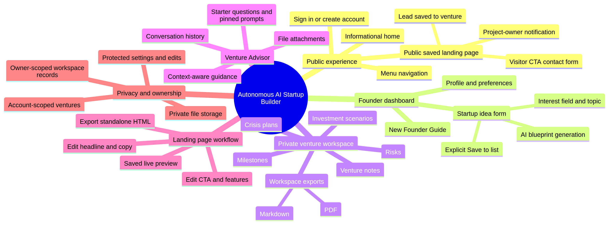
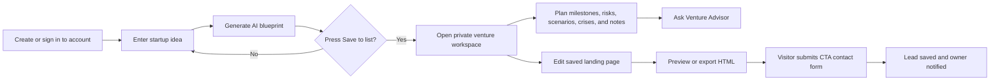

# Autonomous AI Startup Builder: Mind Map and Workflow Overview

This overview explains how the product moves from a founder’s first idea to a managed venture workspace, a shareable landing page, and inbound visitor contacts. **All saved venture records remain scoped to the owner’s account**, while the public landing-page contact form exposes only the information needed for visitors to engage.

## End-to-End Flow

| Step | User action | What the application does | Result |
|---|---|---|---|
| 1. Enter | A visitor opens the public home page. | The app explains the product and offers account access. | The visitor can sign in, register, or learn how the product works. |
| 2. Access dashboard | A founder signs in and opens Dashboard. | The app loads that account’s profile, onboarding progress, saved ventures, and workspace records. | The founder works in a private account area. |
| 3. Define an idea | The founder enters an idea and chooses an interest field and topic. | AI generates a structured startup blueprint with a strategy and landing-page concept. | The founder receives a detailed draft without automatic saving. |
| 4. Save deliberately | The founder presses **Save to list**. | The app stores the blueprint only after this explicit action and creates the suggested venture workspace plan. | The startup becomes a selectable saved venture. |
| 5. Operate the venture | The founder works through milestones, scenarios, risks, crisis plans, notes, and the advisor. | Each record is linked to the selected venture and account. | The workspace becomes an operating plan rather than only an idea generator. |
| 6. Use the advisor | The founder asks the Venture Advisor for guidance or attaches a supported reference file. | The advisor uses venture context, conversation history, and safe attachment metadata. | The founder gets step-by-step planning help. |
| 7. Shape the landing page | The founder opens the saved venture’s landing-page editor. | The headline, supporting copy, CTA label, and three feature cards can be edited and saved. | The venture receives a customised public-facing page. |
| 8. Share or export | The founder opens the saved preview or exports standalone HTML. | The app presents a responsive landing page and can download a self-contained HTML file. | The page can be reviewed, shared, or hosted elsewhere. |
| 9. Capture interest | A visitor clicks the landing-page CTA and submits contact details. | The app saves the lead under the correct venture and triggers a built-in project-owner notification. | The registered project owner can follow up with the visitor. |

## Key Product Areas

| Area | Purpose | Main outputs |
|---|---|---|
| **Public home and account access** | Introduces the builder and routes users to secure account access. | Home content, navigation, sign-in, registration. |
| **AI startup blueprint** | Converts a raw startup idea into a structured strategic plan. | Startup name, market, business model, competitors, marketing plan, landing-page concept. |
| **Venture workspace** | Makes the saved blueprint actionable and manageable over time. | Milestones, scenarios, risks, crisis plans, notes, and workspace exports. |
| **Venture Advisor** | Provides context-aware operating guidance within the selected venture. | Detailed answers, saved conversations, durable actions, supported file attachments. |
| **Landing-page workflow** | Converts a venture message into a shareable customer-facing page. | Editor, live preview, standalone HTML export, contact CTA. |
| **Lead capture and alerts** | Turns visitor interest into a saved, actionable contact. | Lead record and registered project-owner notification. |

> **Important:** The landing-page CTA now records a lead and triggers a built-in project-owner notification. Direct transactional email to any chosen inbox requires a separate email-provider connection.

## Simple Founder Journey

